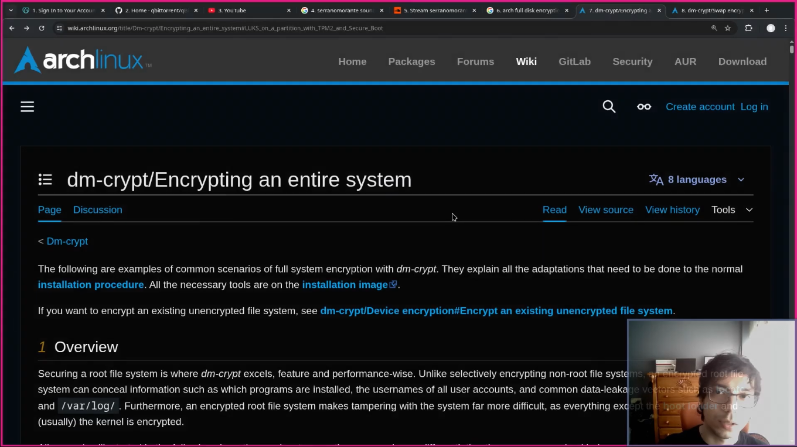

# dotfiles

The exact state of my personal computer (the one that I use everyday) is declared here as ansible playbooks and config files (everything is here except my data).

Even though you can install it I believe this OS is unusable for anyone but me. You can still gather any useful configs from here if you want.

I run `ansible-playbook -K tools.yml -l localhost --tags all` and after a few minutes (1 hour on fresh systems) I'm ready to start working as if nothing has ever happened.

> You might see files like `dot-bashrc` on this repo. They get automatically translated into `.bashrc` files by ansible and stow. I use `dot-*` because a literal dot would make the file hidden by default on file explorers.

I started a youtube channel to talk more about my workflow, setup and ansible.


## How to replicate the full system

If you want to install my system (why would you want that?) you can, but you need **a fresh arch linux installation**:

> only tested on AMD with NVIDIA gpu using linux-lts

### Partitions

2 partitions:

1. at least `40Gb` mounted to root: /
1. at least `50Gb` mounted to home: /home

### Dependencies

A fresh archlinux install with just `git` and `ansible`

### User

You need a user with sudo access. Don't try to run the playbook as root.

### Steps

1. `git clone https://github.com/serranomorante/dotfiles`
1. `cd dotfiles/playbooks`
1. `ansible-playbook -K tools.yml -l localhost --tags all`

The end.

## Advance: install arch with LUKS, secure boot and tpm

I did a video about it [here](/home/aaaa/dotfiles/assets/media/2026-05-04-23-16-20.png):

<div align="left">
    <a href="https://youtu.be/wMLjJtSI9uM">
        
    </a>
</div>

**Important**: this will format your partitions and delete all your data, remove any external drives before proceding

**Important**: this arch install playbook is meant for 2 nvme drives: drive 1 is going to have the EFI, swap and root partitions, drive 2 is going to have home partition. Everything except EFI partition will be encrypted. `EFI`, `swap` and `root` partitions are mounted automatically by `systemd-gpt-auto-generator` while home is mounted by crypttab + fstab.

> Even if you try to test this on a virtual machine, you must setup 2 nvme drives on that virtual machine.

This ansible playbook was run from a remote computer. I haven't tested executing these playbooks from inside the arch bootable usb and I don't recommend you try to do it this way unless you have at least 8GB on your usb.

Requirements:

Disable secure boot and reset/clear the existent keys.

You need 2 public ssh authorization keys on your **booted usb system**

Use this command to generate the keys:

```sh
# the email doesn't matter
ssh-keygen -t ed25519 -C "arch_user@example.com" -f ~/.ssh/ed25519.arch_user -N ""
ssh-keygen -t ed25519 -C "arch_chroot@example.com" -f ~/.ssh/ed25519.arch_chroot -N ""
```

The reason behind this is that one of those two keys is going to run commands in a chroot environment automatically for us and other one is for performing regular tasks like partitioning and encrypting the disks.

On your host system, you need this client ssh config

`cat ~/.ssh/config`

```sshconfig
Host arch-chroot
HostName <the ip of your booted usb system>
User root
IdentitiesOnly yes
IdentityFile ~/.ssh/your private ssh key...arch_chroot

Host arch-user
HostName <the ip of your booted usb system>
User root
IdentitiesOnly yes
IdentityFile ~/.ssh/your private ssh key...arch_user
```

`IdentitiesOnly yes` is required here. Otherwise `ssh-agent` may offer a different loaded key first, and `arch-chroot` can end up authenticating as `arch-user`, which bypasses the forced `command="/root/ssh_chroot"` behavior.

On the guest system:

`vim ~/.ssh/authorized_keys`

```sh
__your arch_user ssh key (public)__
command="/root/ssh_chroot" __your arch_chroot ssh key (public)__
```

`command="/root/ssh_chroot"` is the thing that is going to force that some ansible operations run on a chroot environment.

And finally your ansible inventory should reflect these 2 hosts. [here's my ansible inventory](/home/aaaa/dotfiles/playbooks/inventory.ini)

```
[arch_user]
arch-user

[arch_chroot]
arch-chroot
```

**Important**: you might need to run `rm -rf ~/.ansible` at some point if ansible cache is giving you problems

**Important**: these playbook are not design in a indempotent way, everything should work ok on the first run otherwise it will format the partitions again and again.

As the last there are some variables in the ansible playbooks that you need to fill manually:

Variables:

- **system_disk_by_id** The id of the first physical drive which is going to host our system files, swap, etc\
  Execute: `ls -l /dev/disk/by-id | grep nvme` to find this value
- **home_disk_by_id** The id of the second physical drive for our home partition\
  Same here, execute: `ls -l /dev/disk/by-id | grep nvme`
- **luks_pass**\
  The password to encrypt your drives using LUKS
- **tpm_pin**\
  The password you will input everytime your machine boots
- **username**\
  The username you want to create
- **user password**\
  The password for that user

Now you can run the playbooks like this:

First, the initial setup, all tasks should work.

`ansible-playbook arch-user-setup.yml -l arch_user`

Then, the chroot setup, all tasks should work. When this playbook ends you should manually restart your computer and enable secure boot.

`ansible-playbook arch-chroot-setup.yml -l arch_chroot`

Lastly, we do a new pass on the first playbook again to complete installation. Then reboot.

`ansible-playbook arch-user-setup.yml -l arch_user`

Now you will have a full disk encrypted arch linux install with tpm2 and secure boot. You can continue by installing your desktop environment.

## Some guides to my self

- [Python development setup with Neovim](./docs/python-dev-setup.md)
- [keyd special chars setup](./docs/keyd-setup.md)
- [disable internal keyboard with libinput and keyd](./docs/disable-internal-keyboard.md)
- [migrate from optimus-manager to official NVIDIA prime](./docs/nvidia-setup.md)
- [nvim-dap and node cli app written in typescript](./docs/nvim-dap-node-cli.md)
- [Comments on neovim plugins journey](/docs/nvim-plugins.md)
